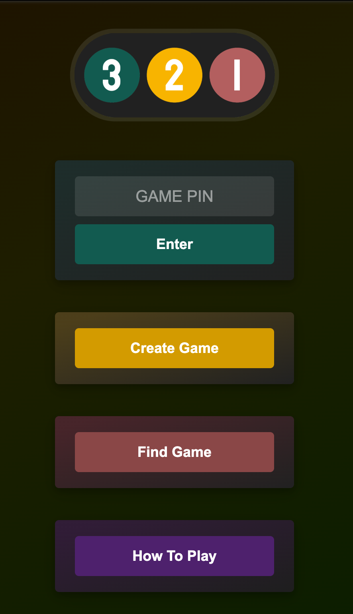
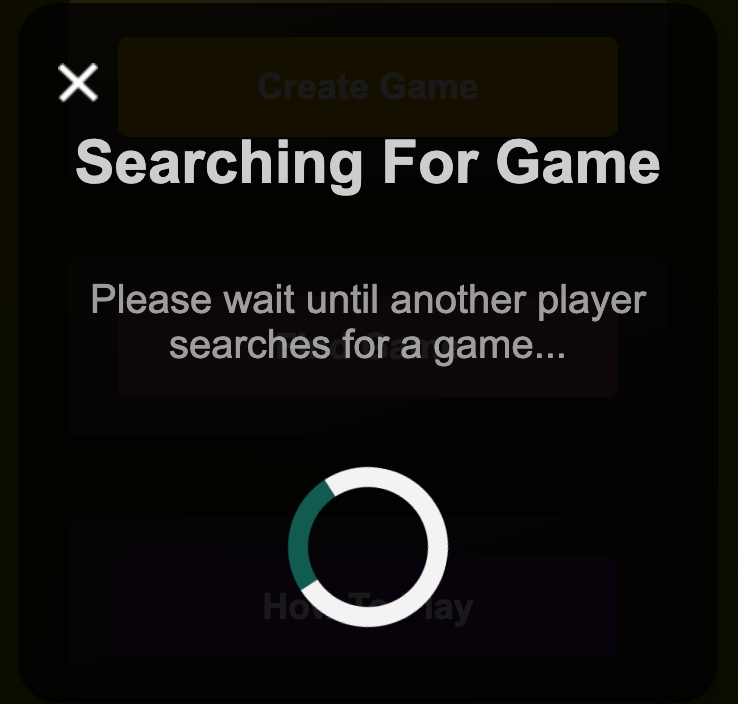

<p align="center">
  
</p>

A two-player cooperative word-association game.  
The goal: **both players independently arrive at the same word without directly communicating.**

---

## Table of Contents
- [How to Play](#how-to-play)
- [Screenshots](#screenshots)
- [Game Flow Example](#game-flow-example)
- [Architecture](#architecture)
- [Key Code Snippets](#key-code-snippets)
- [Installation](#installation)

---

## How to Play
- Two players join a shared room.
- Both secretly type in random words.
- Their words are revealed to each other.
- Each player then tries to find a word that **connects** the two previous words.
- The cycle repeats until both players type the **same word**.
- If they converge on the same guess, they win!

---

## Game Flow Example
1. Player One starts with the random word: **plastic**  
2. Player Two starts with another random word: **container**  
3. The words are revealed.  
   - Player One thinks of a connection and submits **bag**.  
   - Player Two thinks of a connection and submits **bin**.  
4. New words are revealed: **bag** and **bin**.  
   - Player One guesses **garbage**.  
   - Player Two also guesses **garbage**.  
5. Both words match → **Victory!**

---

## Screenshots
<p align="center">
  
  
</p>

---

## Architecture

The project uses:
- **Express.js** for HTTP routes and serving static files (`public/` directory with EJS templates).
- **WebSockets (`ws`)** for real-time two-player communication:
  - Manages rooms, user joins/leaves, timeouts.
  - Provides a **queue + matchmaking system** (`find game`).
- **Room codes**: 5-character alphanumeric IDs allow friends to share a game directly.
- **Timeout system**: Cleans up inactive rooms to prevent memory bloat.

---

## Key Code Snippets

### Express setup
```js
const express = require('express');
const path = require('path');
const app = express();

app.use(express.static('public'));
app.set('view engine', 'ejs');

const server = app.listen(5000, () => {
  console.log(`Listening on ${server.address().port}`);
});
```

### WebSocket server and matchmaking
```js
const WebSocket = require('ws');
const wss = new WebSocket.Server({ port:8082 });

const rooms = [];
var queue = [];

wss.on("connection", (ws) => {
  ws.on("message", (event) =>{
    const data = JSON.parse(event);
    switch (data.type) {
      case "find game":
        queue.push(ws);
        if (queue.length === 2){
          const roomCode = wss.generateRoomCode();
          const newRoom = { code: roomCode, users: [1,1], started: false, pubWords:[["",""]], privWords:[["",""]] };
          rooms.push(newRoom);
          queue.forEach(user => user.send(JSON.stringify({ type:"found game", code: roomCode })));
          queue = [];
        }
        break;
    }
  });
});
```

### Word submission & victory check
```js
case "word submit":
  // Save submitted word to player's slot
  // When both slots filled → compare words
  if (wordOne === wordTwo) {
    ws.send(JSON.stringify({ type: "game over", words: [wordOne, wordTwo] }));
  } else {
    ws.send(JSON.stringify({ type: "continue", words: [wordOne, wordTwo] }));
  }
  break;
```

---

## Installation

Clone the repo and install dependencies:
```bash
git clone https://github.com/yourname/321-game.git
cd 321-game
npm install
```

Run the server:
```bash
npm start
```

By default:
- HTTP server runs on `localhost:5000`
- WebSocket server runs on `localhost:8082`

Access via browser: [http://localhost:5000](http://localhost:5000)


